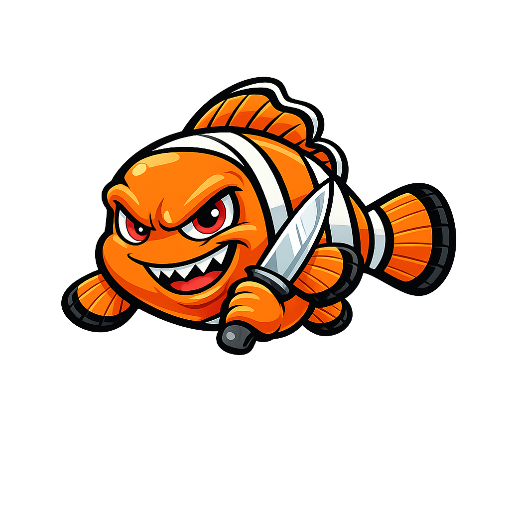

# Finding Evil

Hands-on cybersecurity workshop based on a lab running Elasticsearch + Sysmon + Atomic Red Team.

## Table of Contents
- [Lab Setup Checklist](labchecklist.md)
- [Core Concepts](findingevil.md)
- Walkthrough
- [Common Event Codes](eventcodes.md)
- [KQL Syntax](KQL.md)
- Lab Build Guide
